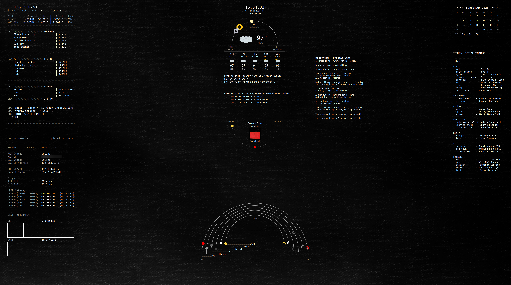

# gtex62-clean-suite-e

Engine-driven conversion of gtex62-clean-suite. The first legacy suite ported to the
core-native model established by gtex62-osa.

Requires [gtex62-core](../gtex62-core) `>=1.0,<2.0`.

---

## Screenshots / Design References



*The full suite — monitor, ambient, and media chassis, plus the calendar, notes,
and pfSense standalones — running the default palette.*

---

## Panel Map

### Chassis: Monitor (`clean-monitor`)

| Panel | Content                                                    |
| ----- | ---------------------------------------------------------- |
| SYS   | CPU model, core load, RAM, GPU, top processes              |
| NET   | Primary interface, WAN IP, throughput, VLAN gateway status |

### Chassis: Ambient (`clean-ambient`)

| Panel | Content                                                                                                                                                                          |
| ----- | -------------------------------------------------------------------------------------------------------------------------------------------------------------------------------- |
| WXR   | Current conditions, 5-day forecast, METAR, TAF (SIGMET/AIRMET advisories drawn but disabled — `panels.wxr.aviation.advisories.enabled = false`, off in the legacy theme as well) |
| ORB   | Horizon arc — sun, moon, and visible planets by azimuth                                                                                                                          |
| TME   | Local clock, UTC, date                                                                                                                                                           |

### Chassis: Media (`clean-media`)

| Panel  | Content                                        |
| ------ | ---------------------------------------------- |
| MSC    | Now-playing arc, album art, title/album/artist |
| LYRICS | Current track lyrics                           |

### Standalone: Calendar (`clean-calendar`)

Month grid with nav-arrow title, weekend/today highlighting. Its own top-level
Conky instance since 2026-07-19 — the legacy widget's position is disjoint
from the ambient chassis footprint, so it can't be folded in as a sub-panel.

### Standalone: Notes (`clean-notes`)

Sticky notes read from `~/Documents/conky-notes.txt`. Standalone since
2026-07-20, for the same reason as the calendar.

### Standalone: pfSense (`clean-pfsense`) — optional

VLAN traffic flow arcs for WAN / HOME / IOT / GUEST / INFRA / CAM interfaces.
Requires pfSense reachable via SSH. Data from the core `pfsense` provider.

For pfBlockerNG stats, Pi-hole status, AP client counts, and cumulative data
totals, use the `sitrep` core utility (not part of this suite).

---

## Requirements

- Conky with Lua + Cairo support, for example `conky-all`
- `bash`, `jq`, `curl`
- `python3` (3.11 or newer recommended; `jq` and `python3` are checked at launch)
- The `gtex62-core` engine, expected at `~/.config/conky/gtex62-core`

Debian / Ubuntu / Mint example:

```bash
sudo apt install -y conky-all jq curl python3
```

---

## Quick Start

```bash
# First run — bootstrap runtime config
./scripts/bootstrap-runtime.sh

# Launch suite
./scripts/start-conky.sh
```

---

## Palette Selection

`start-conky.sh` does not prompt for a palette — launch always falls back to
the `default` palette unless overridden. Available palettes are defined in
`theme/clean-palettes.lua`. To launch with a specific palette:

```bash
GTEX62_PALETTE=dark ./scripts/start-conky.sh
```

---

## Customization

| File                       | Purpose                                        |
| -------------------------- | ---------------------------------------------- |
| `theme/clean-palettes.lua` | Color schemes                                  |
| `theme/clean-theme.lua`    | Fonts, stroke widths, frame effects            |
| `theme/clean-layout.lua`   | Chassis dimensions and monitor targeting       |
| `theme/panels.lua`         | Per-panel position, size, and sub-box geometry |

---

## What Changed from clean-suite

- Data collection delegated to gtex62-core providers (no local fetch scripts)
- 9 legacy Conky processes consolidated into 3 chassis (monitor/ambient/media)
  and 3 standalones (calendar/notes/pfsense)
- `apwbe` widget retired — AP status now in core `sitrep` utility
- pfSense widget draws VLAN flow only; status/totals moved to `sitrep`
- Theme split into palette / theme / layout / panels files
- Palette switchable via `GTEX62_PALETTE` (was a single fixed color scheme) —
  see Palette Selection above
- Astronomy uses core `astro` provider (altitude/azimuth) replacing PyEphem sky_update.py
- Monitor targeting via `xinerama_head` (no hardcoded pixel offsets)

---

## License

See [LICENSE](LICENSE).
